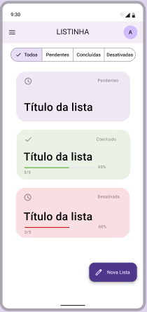

# ToDo Market

Application to create several lists to be used simultaneously and synchronized in the cloud after the data is saved locally (**Offline-first**).

# 1. Features

1. Simplest authentication possible.
2. Register several different lists.
3. Check and uncheck items by repositioning the unchecked ones.
4. Sync data in the cloud.
5. Editing authenticated user.
6. Device Configuration.

## 1.1 Authentication as simple as possible

Authentication is required to perform the synchronization and must be optional, that is, requested when the user manually performs the synchronization.
The application must support Authentication “without password” (**Passwordless**) sending the token by email to access it.

## 1.2 Register several different lists.

The user will be able to create a limited number of shopping lists, showing the total information of the list such as: Name of the List, R$ value (if any) and status in the form of a card.

List statuses should be: Pending, Completed, Disabled.

The user will be able to filter the lists by status.

## 1.3 Mark and unmark items by repositioning unmarked ones.

Each list will need to split the checked items from the unchecked items and give the user the option to reposition the unchecked items.

## 1.4 Synchronize data in the cloud.

All lists and their data will be stored locally on the user's device, being later synchronized in the cloud. Synchronization must be automatic and attempts to synchronize in case of failure must be done within minutes. This last point is important to save battery life on mobile devices.

## 1.5 Authenticated user editing.

If authenticated, the user should be able to change information such as First Name, Last Name and profile picture.

## 1.6 Device Configuration.

The app should have theme control and cache removal options.

# 2. User Experience

Every interface will be made using pre-built Material Design 3 components.
Mockup, font and assets information are available on Figma.

[Figma Link](https://www.figma.com/file/xSoyauWGMb25dsQCBrhPa5/Listinha?node-id=53095%3A27267&t=9eobg3NOs476wXmo-1)

# 3. Architecture

[General](ARCHITECTURE.md)
